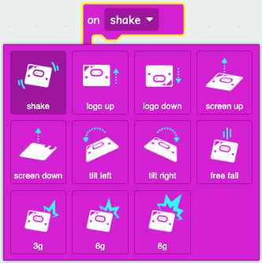

## Use the accelerometer to trigger an action.

You can find the `on shake`{:class='microbitinput'} block in the `Input`{:class='microbitinput'} menu in your Toolbox.

<iframe style="position:relative;top:0;left:0;width:50%;height:100%;" src="https://makecode.microbit.org/---codeembed#pub:_Wff4v7MYXLrR" allowfullscreen="allowfullscreen" frameborder="0" sandbox="allow-scripts allow-same-origin"></iframe>

Select the dropdown arrow next to `shake` to choose a different gesture.

You can get more accurate movement values using `rotation`{:class='microbitinput'}.

- You can also find the `rotation`{:class='microbitinput'} block in the `Input`{:class='microbitinput'} menu in your Toolbox.

This could be used in a compare against a maximum `roll` value to trigger an event.

Here is an example.

<iframe style="position:relative;top:0;left:0;width:100%;height:100%;" src="https://makecode.microbit.org/---codeembed#pub:_gzvM5a8MgA4f" allowfullscreen="allowfullscreen" frameborder="0" sandbox="allow-scripts allow-same-origin"></iframe>

Here is the code running on the simulator.

Roll the micro:bit left or right to trigger the icon to change.

<iframe style="position:absolute;top:0;left:0;width:60%;height:100%;" src="https://makecode.microbit.org/---run?id=_gzvM5a8MgA4f" allowfullscreen="allowfullscreen" sandbox="allow-popups allow-forms allow-scripts allow-same-origin" frameborder="0"></iframe>
